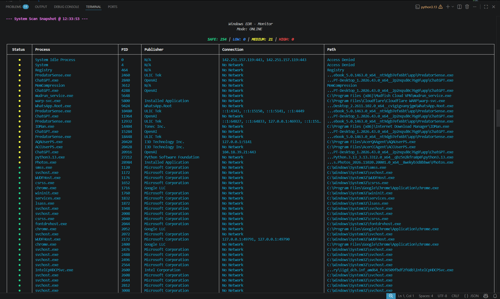
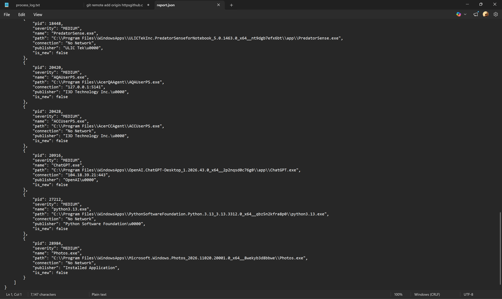

# Windows Service & Process Monitoring Agent 🛡️

A lightweight, Python-based Endpoint Detection and Response (EDR) tool that monitors active Windows processes, verifies file signatures, and analyzes network connections in real-time. 

This agent combines local SMART heuristics with cloud-based threat intelligence (VirusTotal and AbuseIPDB) to identify suspicious behavior, malware, and unauthorized network communications on Windows machines.

## 📸 Screenshots




> *Real-time process monitoring with color-coded severity and network analysis.*


> *Automated summary generation upon terminating the monitoring session.*

## 🚀 Key Features

* **Real-Time Process Monitoring:** Scans active processes and flags new executions dynamically.
* **SMART Local Heuristics:** Automatically flags unsigned binaries executing from suspicious directories (e.g., `Temp`, `AppData`, `Downloads`).
* **Cloud Threat Intelligence:** * Integrates with **VirusTotal** to check SHA-256 file hashes.
  * Integrates with **AbuseIPDB** to analyze the reputation of outbound network connections.
* **Sequential Dashboard:** Utilizes the `Rich` Python library to generate clean, color-coded, and perfectly aligned terminal UI tables that support native mouse scrolling.
* **Automated Logging & Reporting:** * Generates a permanent, structured text log of all process activity (`logs/process_log.txt`).
  * Automatically compiles a structured JSON report (`report.json`) of all Medium and High severity threats upon termination.

---
## 📁 Project Structure

```
 Windows Service & Process Monitor/
├── logs/                   # Directory for automated text logs
│   └── process_log.txt     # Standardized record of all monitored events
├── images/                 # Folder containing README screenshots
│   ├── dashboard.jpg       # Visual of the live monitoring interface
│   └── report.jpg          # Visual of the final incident summary
├── analyzer_utils.py       # Core logic for signatures, hashes, and cloud API calls
├── config.py               # Local settings, whitelists, and private API keys
├── dashboard.py            # Rich-based UI logic for the terminal table
├── detection_engine.py     # Rules for parent-child and temp execution anomalies
├── logger.py               # Handles formatted file logging and system events
├── main.py                 # The central execution loop and process iterator
├── process_monitor.py      # Basic process tracking and keyword scanning
├── report_generator.py     # Compiles threat data into a structured JSON report
├── requirements.txt        # List of necessary Python dependencies
├── service_monitor.py      # WMI-based logic for scanning Windows services
├── vt_cache.json           # Local cache to optimize VirusTotal API usage
└── README.md               # Project documentation and setup guide
```
## 🛠️ Prerequisites

* Windows Operating System
* Python 3.8+
* Free API Keys from [VirusTotal](https://www.virustotal.com/) and [AbuseIPDB](https://www.abuseipdb.com/)

## 📦 Installation

1. **Clone the repository:**
   ```bash
   git clone [https://github.com/KarthikGoDsEyE/windows-process-monitoring-agent.git](https://github.com/KarthikGoDsEyE/windows-process-monitoring-agent.git)
   cd windows-process-monitoring-agent

   **Install required dependencies:**

    Bash
    pip install psutil rich requests wmi colorama
   **Configure API Keys:**
Create a file named config.py in the root directory (ensure this file is in your .gitignore to protect your keys). Add your API keys and configuration settings:

      Python
    # config.py
    CHECK_INTERVAL = 3

    WHITELIST = [
    "System",
    "System Idle Process",
    "explorer.exe",
    "svchost.exe",
    ]

    LOG_FILE = "logs/process_log.txt"
    REPORT_FILE = "report.json"

    # Add your API Keys here
    VT_API_KEY = "your_virustotal_api_key_here"
    ABUSEIPDB_API_KEY = "your_abuseipdb_api_key_here"
    
💻 **Usage**
Run the main agent script from your terminal:

    Bash
    python main.py
Monitoring: The terminal will output a fresh snapshot of active processes sequentially.

Indicators: * 🔴 HIGH / MALICIOUS: Known malware or critical threat.

🟡 MEDIUM: Suspicious behavior, unsigned file, or questionable network connection.

🔵 LOW: Valid signature but warrants monitoring.

🟢 SAFE: Trusted publisher or local system process.

Exiting: Press Q at any time to safely terminate the agent, generate the final JSON report, and save the API cache.

⚠️ Disclaimer
This tool is designed for educational and defensive security purposes. The developers are not responsible for any misuse or damage caused by this software.
